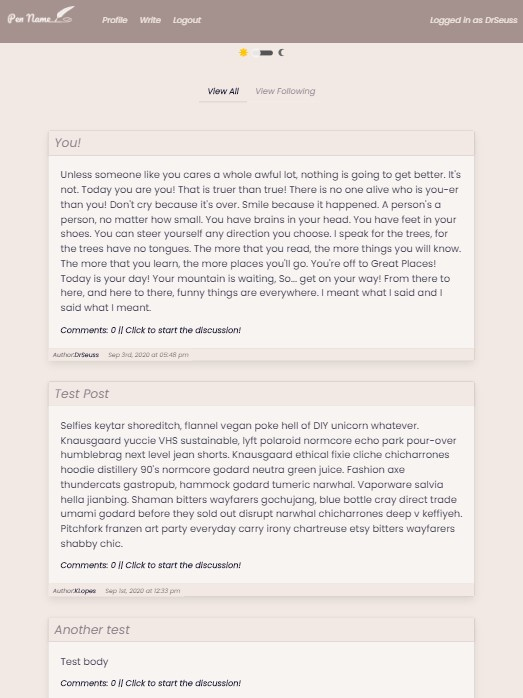
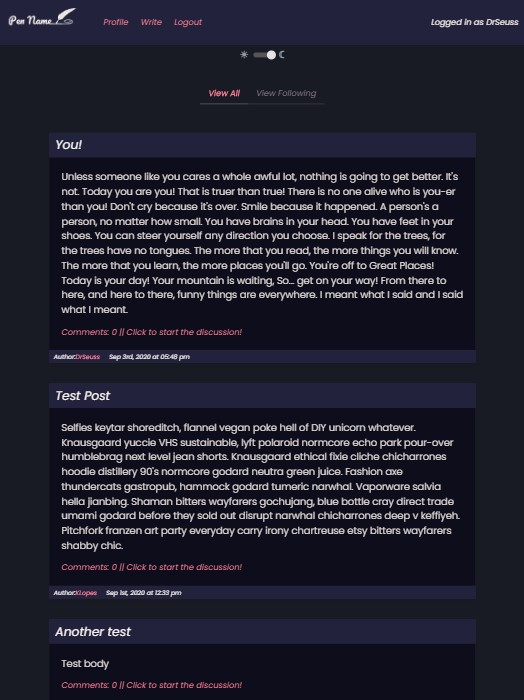

<h1 align="center">Pen Name</h1>

<p align="center">
    
    
    
    
    
    
</p>  

<h2 align="center">Mobile Phone View</h2>  

<p align='center'>
    
    
</p>  
  
<h2 align="center">Tablet View</h2>  
  


<p align='center'>
    
    
</p>


## Table of Contents
- [Description](#description)
- [Installation](#install)
- [Usage](#usage)
- [Questions](#questions)

## Description
Pen Name is a social media/blog type mobile first application, that gives users a place to share their own or favorite literary works. The user has the ability to view shared works even without logging in. If the user choices to sign up and log in then they will have the ability to follow their favorite other authors, share their own work, comment, and customize a personal profile page.  
  
## Install
If you would like to clone and use this application then clone the repo (Link found down below). Once cloned enter the root folder and ---  

```
npm install
```

## Usage
### Once install is complete run 
```
npm start
```  
Page will open in browser automatically or go to localhost:3000/

## Below is a link to the GitHub repository   
[Pen Name](https://github.com/CodyDiab/pen-name)    

### Deployed app to Heroku 
[Pen Name](https://protected-harbor-84928.herokuapp.com/) 


## Questions
### Github's
#### [Kaynalem for Github](https://github.com/Kaynalem)
#### [CodyDiab for Github](https://github.com/CodyDiab)
#### [Mattkohl82 for GitHub](https://github.com/Mattkohl82) 

### Emails  

#### Kaynalem@gmail.com for ✉️ email 
#### emailcodydiab@gmail.com for ✉️ email  
#### mattkohl82@gmail.com for ✉️ email 
